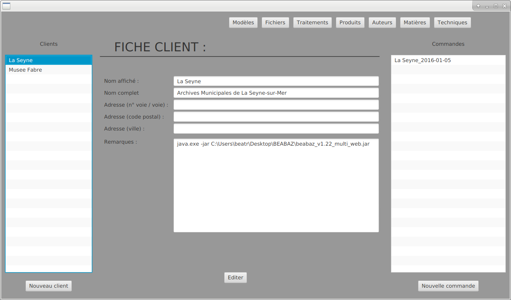
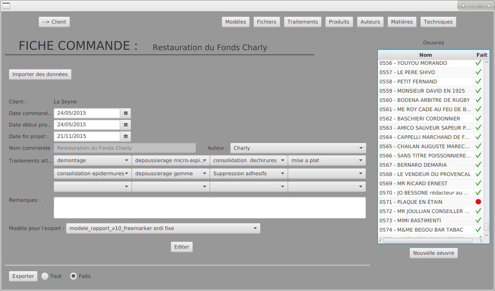
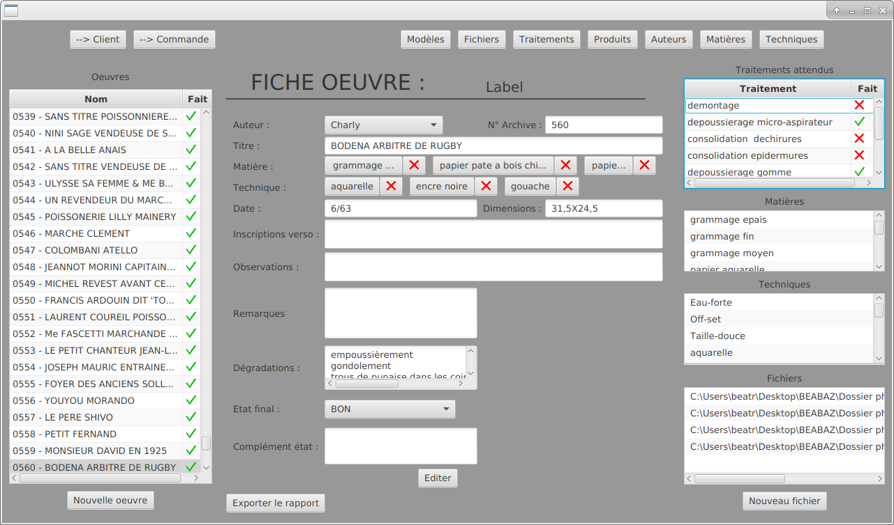
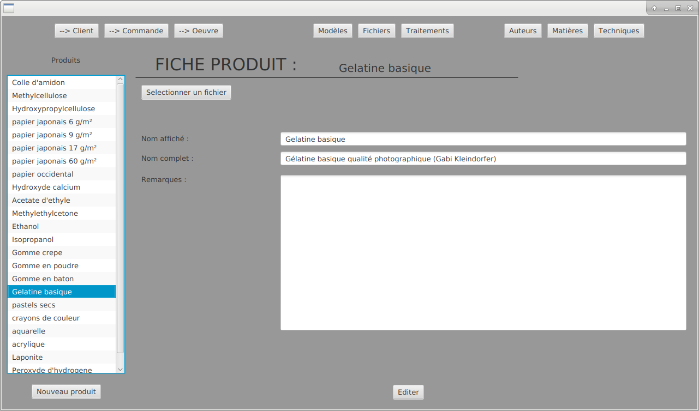

# BEA_BAZ
*interface de gestion des grands lots de rapports (javaFX + mongodb)*

####gestion des clients et des commandes

####paramètres d'une commande

####paramètres d'une oeuvre

####paramètres d'un produit

